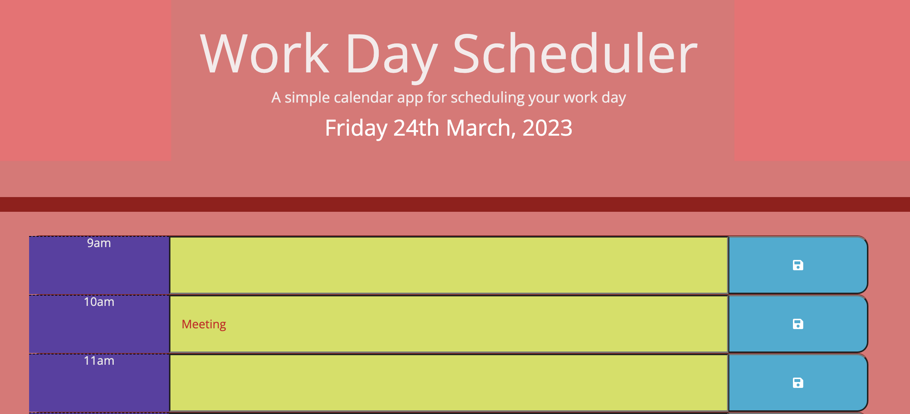

# Daily-Planner-App
A simple calendar application that allows a user to save events for each hour of the day by modifying starter code. This app will run in the browser and feature dynamically updated HTML and CSS powered by jQuery

## Description
This daily app planner allows user to scroll through the events listed for the day. It serves as a reminder of any appointments or tasks that the user may need to complete. 

## Deployed Information
The planner displays the working hours of 9am - 5pm (per one hour slot). 
It allows the user to type a message/note in and save it to local storage. 
Even if refreshed or close the app, the information would still be available - avoiding the risk of losing the stored information. 

## Screenshot

## Link to Deployed application
https://shahee05.github.io/Daily-Planner-App/

## License
MIT License

## Project Status
Working with Third-Party APIs (jQuery) - ongoing

## Other information
Further help received from team members and StackOverflow. 

